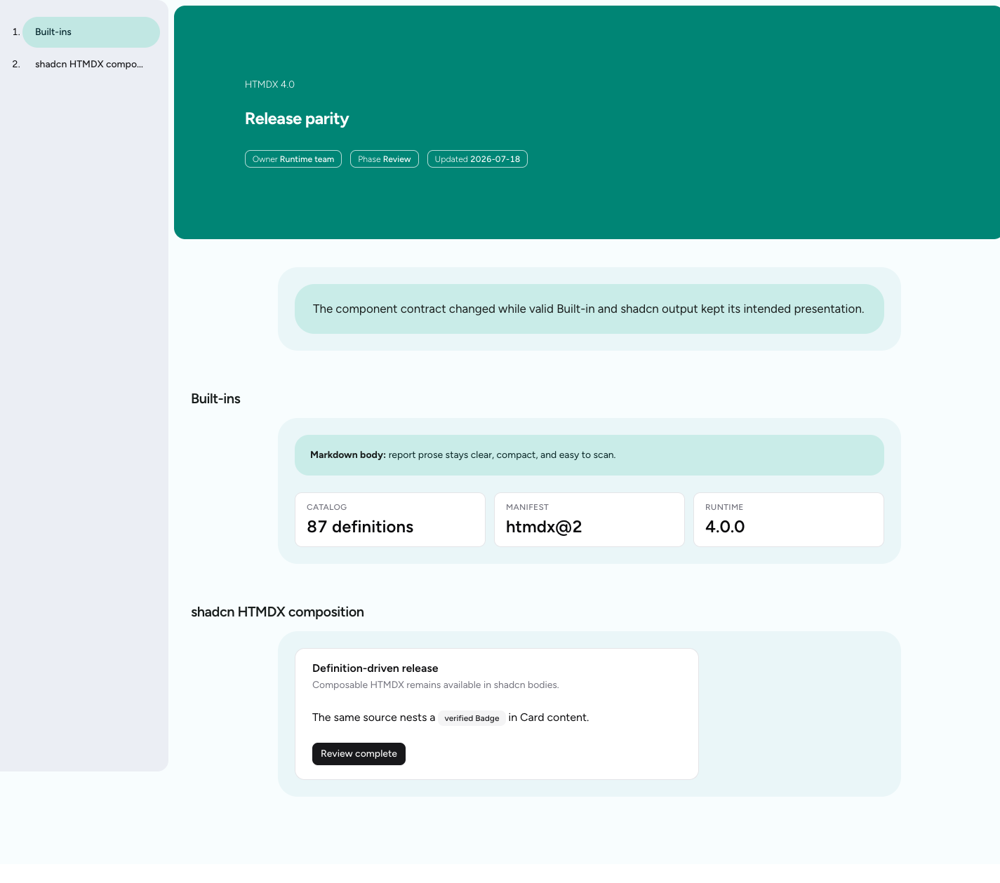

# HTMDX 4.0 release evidence

This folder records the review evidence for the component-definition change. The “before” files come from the built output of `01533d331761c21e73dbbcc1fca2cf3d0ca40ae8`, the merge base with `master` before the refactor. The “after” files come from the 4.0 branch after the final guidance update. No published or hand-written JSON stands in for either build.

## Agent-facing manifest

- [`manifest-before-3.0.0.json`](./manifest-before-3.0.0.json): generated by the 3.0.0 library build at the merge base.
- [`manifest-after-4.0.0.json`](./manifest-after-4.0.0.json): generated by the 4.0.0 library build.

Both full catalogs contain 87 entries. The new envelope changes from `htmdx-react@1` / `@wix/htmdx@3.0.0` to `htmdx@2` / `@wix/htmdx@4.0.0`. The 4.0 note defines all three body modes, universal attributes, typed prop parsing and constraints, and the limits of the declarative language. Every 4.0 entry has a body mode and generated `source`; 34 entries have an authoritative typed prop schema, up from 14 entries with the older advisory prop data. For example, `Badge` now declares `body: "htmdx"` and a typed `variant` prop with its values, default, and description.

## Rendering parity

[`parity-artifact.html`](./parity-artifact.html) is one source used for both captures. It contains representative Built-ins (`ExecutiveSummary`, `Callout`, and `MetricStrip`) and a shadcn `Card` composition with nested `Card` parts, `Badge`, and `Button`.

| Merge-base 3.0 runtime | Final 4.0 runtime |
| --- | --- |
|  |  |

The captures use the built `dist/browser.js` from each revision, a 1440 × 1100 viewport, and the same local artifact. They show the same document chrome, Built-in presentation, metric layout, and shadcn composition across the architecture change. The screenshots provide the style check; automated tests do not assert CSS classes or styles.

## Validation scope

The release checks cover HTMDX-owned work: definition and manifest projection, body and prop contracts, external registration, canonical examples, Built-in parsing and rendering, all three shipped examples, library output, and Storybook output. The test suite deliberately does not retest shadcn or Radix interaction behavior and does not assert shadcn DOM details, CSS classes, or styles; those belong to their upstream projects and visual review.

The final checks run for this evidence are:

- package typecheck;
- lint and format check;
- full HTMDX test suite;
- library build, including all canonical examples and generated manifest;
- Storybook static build;
- compile checks for every HTML file under `examples/`;
- browser rendering of the parity artifact with both built runtimes.
